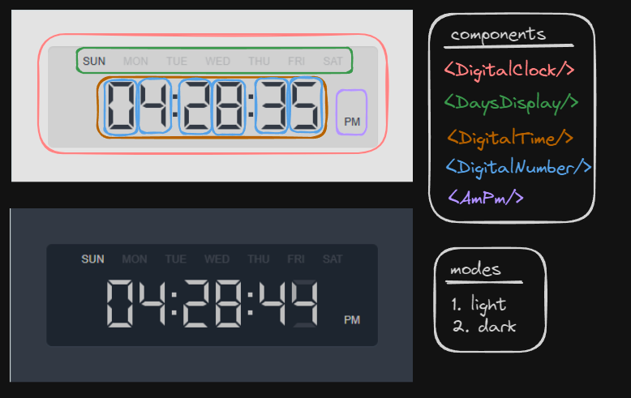
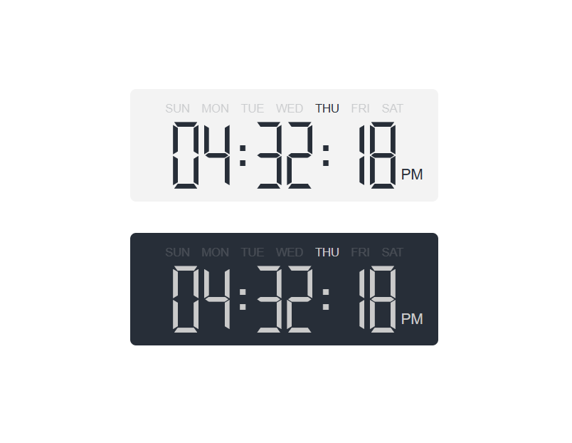

# my-awesome-react-digital-clock

A customizable React component for displaying a digital clock with day and AM/PM indicator, supporting both light and
dark modes.

## Live Demo

https://adimalka14.github.io/digital-clock-component/

## Installation

```bash
npm install my-awesome-react-digital-clock
```

Make sure you have React (v19+) installed, as defined in the peer dependencies.

## Usage

### Using the Hook

``` jsx Copy
import React from 'react';
import { DigitalClock } from 'my-awesome-react-digital-clock';

function MyDigitalClock() {

return (
  <>
      {/* Default */}
      <DigitalClock />
      <DigitalClock
          bgColor={'#424242'}
          fgColor={'#fff'}
          hoverColor={'rgba(66,66,66,0.66)'}
          size={300}
          format={'12h'}
          timezone={'Europe/Berlin'}
      />
      <DigitalClock
          bgColor={'#f4f4f4'}
          fgColor={'#248cff'}
          hoverColor={'rgba(186,231,255,0.55)'}
          size={500}
          format={'24h'}
          timezone={'UTC'}
      />
      <DigitalClock
          bgColor={'#f4f4f4'}
          fgColor={'rgba(255,36,36,0.91)'}
          hoverColor={'rgba(255,36,36,0.34)'}
          size={650}
          format={'24h'}
          timezone={'Europe/London'}
      />
  <>
);
}
export default MyDigitalClock;
```

## Props

### Timer

| Prop           | Type              | Default               | Description       |
|----------------|-------------------|-----------------------|-------------------|
| **size**       | Number            | 250                   | size in px        |
| **bgColor**    | String            | `#424242`             | Background color  |                |                   | `light`   | Digital clock.   |
| **fgColor**    | String            | `#fff`                | Foreground color  |                 | `light`   | Digital clock.   |
| **hoverColor** | String            | `rgba(66,66,66,0.66)` | Hover color       |                 | `light`   | Digital clock.   |
| **format**     | '24h' or '12h' | '24h'                 | Display time format |
| **timeZone**   | String            | current timezone      | Timezone          |                     | `light`   | Digital clock.      |

Note: When color="dark", the clock will use a darker background/foreground (defined internally) to make it look better
in dark mode.

## Plan & Design



## Final Outcome



## Contributing

1. Fork this repository
2. Create a new branch for your feature or bugfix: git checkout -b feature/some-improvement
3. Make your changes, write tests, commit, and push
4. Create a Pull Request with a clear explanation of what you’ve done
5. All contributions and suggestions are welcome!

## License

This project is licensed under the [MIT License](./LICENSE).
