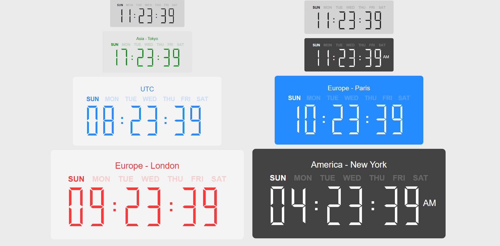

# my-awesome-react-digital-clock

A customizable React component for displaying a digital clock with day and AM/PM indicator, supporting both light and dark modes.

## Live Demo
Coming soon...

## Installation
```bash
npm install my-awesome-react-digital-clock
```
Make sure you have React (v19+) installed, as defined in the peer dependencies.

## Usage
### Using the Digital Clock
``` jsx Copy
import React from 'react';
import { DigitalClock } from 'my-awesome-react-digital-clock';

function MyDigitalClock() {

return (
  <>
      {/* Default: light mode */}
      <DigitalClock />

      {/* Explicit dark mode */}
      <DigitalClock color="dark" />
  <>
);
}
export default MyDigitalClock;
```

## Props
### Timer
| Prop      | Type              | Default | Description    |
|-----------|-------------------|--------|----------------|
| **color** | `dark` or `light` | `light` | Digital clock. |
Note: When color="dark", the clock will use a darker background/foreground (defined internally) to make it look better in dark mode.

## Plan & Design 


## Final Outcome


## Contributing
1. Fork this repository
2. Create a new branch for your feature or bugfix: git checkout -b feature/some-improvement
3. Make your changes, write tests, commit, and push
4. Create a Pull Request with a clear explanation of what you’ve done
5. All contributions and suggestions are welcome!

## License
This project is licensed under the [MIT License](./LICENSE).
